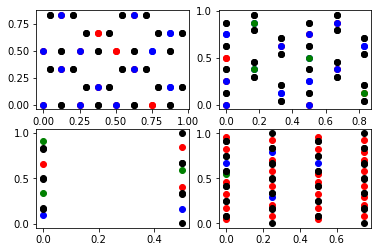
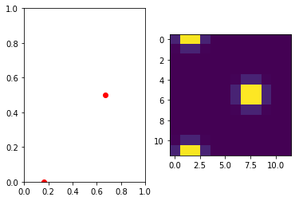

Nomad
===

## Challenge description

Challenge "Nomad2018 Predicting Transparent Conductors" hosted by kaggle: https://www.kaggle.com/c/nomad2018-predict-transparent-conductors/

This competition aimed at developing efficient data-driven techniques to predict 2 important physical properties of transparent semiconductors: the formation energy (indicator of the stability of a new material) and the bandgap energy (indicator of the potential for transparency over the visible range).

## Data and metric

Due to the difficulty of gathering ground-truth labels, the challenge was very data-limited with only 2400 samples in train and 600 samples in test. The public leaderboard measured the accuracy on 100 test samples (thus not reliable) and the private leaderboard on the remaining 500 test samples.

There were 2 types of input data:

- csv files providing a limited list of important physical indicators for each sample
- detailed geometry txt files providing the lattice vectors and the position and type of each atom for each sample (with atom types necessarily in the following list: 'Al', 'Ga', 'In', 'O')

This geometry file actually provided exhaustive information about each sample.

The metric to optimize was the average root mean squared logarithmic error (RMSLE) of the 2 physical properties: formation energy and bandgap energy.

## Visualization

Visualization of atom positions relatively to lattice cells revealed very particular structures, with usually a particular role of the lattice directions.

### Data Preprocessing

Different options were available to extract information from geometry txt files:

- extract atom type and position from each line sequentially to construct sequences of variable sizes, that could be later fed to a RNN
- extract atom type and position from each line to construct 3D cubes encoding the density of each atom type in the lattice cell 

I concentrated my approaches on this second choice. 

I adopted the simple procedure consisting in attaching around each atom a small sphere of density with a Gaussian profile and a radius of the same order as the pixel size. The 3D cube value for each channel and each pixel position was then given by the sum of density of all atoms corresponding to this particular channel at this particular position.

I made 2 particular choices:

1. Instead of just taking the density value at the center of each pixel, I computed an approximate integral value in each pixel (thus mitigating the loss of resolution)
2. To take into account the periodicity of the material, I included atom positions in adjacent lattice cells that were close enough to have an influence on the pixelized lattice cell (in this way, 3D cubes were made covariant with the arbitrary choice of the origin of the lattice cell)

## Approach 1: SVR and model stacking

In this first approach, I added a dimensionality reduction step in the preprocessing of the 3D cubes. I simply used PCA to compute the main N components over all samples and project each 3D cube onto these N components. 

Then I trained a SVR model with the following inputs concatenated for each sample:

- Base features from the csv file
- Projection of the 3D cube on its main PCA components

I further improved my results using model stacking (see e.g. here: https://www.kdnuggets.com/2017/02/stacking-models-imropved-predictions.html), which consists in training various first-level models and to combine these individual predictions in a second-level model (it is even possible to continue this process with more levels).

In theory, stacking benefits the most from uncorrelated prediction, i.e. from models as diverse as possible. Here I simply used the following models:

- SVR with the 3 different choices of kernel: 'gaussian', 'sigmoid', 'polynomial'
- Kernel Ridge Regression
- XGBoost

For the second-level meta-model, I used SVR again.

### Results

The plain SVR approach already gave very good results with a cross-validation RMSLE of 5.2 and a position in top 1% on the public leaderboard (though it was not reliable).

As for the meta-model, it gave a cross-validation RMSLE of 4.9 and also a top 1% position on the public leaderboard. However, as could be expected, it was mostly due to the variance and the final position on the private leaderboard was 41 of 883 in top 5%.

## Approach 2: CNN

I tried a second approach based on 3D Convolution Neural Networks (CNNs) to process 3D cubes. For this, a few specificities had to be taken into account:

1. Materials are periodic
2. A pixelized 3D cube of the lattice cell does not provide exhaustive information about the material, since it must be combined with the information on the lattice vectors
3. In the same way as color images have a 3rd dimension for the color channels, a 4th dimension had to be introduced to distinguish atom types ('Al', 'Ga', 'In' or 'O')

### Choice of model and training

I designed the model architecture to take into account problem specificities:

- to take into account the periodicity of the 3D cubes, I implemented a custom keras layer that first padded the input with periodic conditions, and then performed a standard convolution operation with a "valid" border condition
- to deal with the heterogeneous inputs, I simply merged the output of the CNN processing of 3D cubes with secondary inputs, and this merged information was further processed by a feedforward network.

I made standard choices of model regularization with Batch Normalization layers in the CNN and Dropout layers between Dense layers.

I also used resnet skip connections in the CNN and the swish activation function in both the CNN and the feedforward parts, which enabled a very efficient optimization despite model depth.

For the training, I used the Adam optimizer and the keras callback "ReduceLROnPlateau" to appropriately decrease the learning rate when the optimizer was stuck.

### Data Augmentation

I exploited the invariance of the output values with respect to a few geometrical transforms:

- random shift of all atom positions in the lattice cell (corresponding to the choice of origin of the lattice cell)
- random flipping of each axis
- random permutation of the 3 axes of the lattice cell

These transforms were used as a Data Augmentation strategy to create additional valid samples for training. Since they were strictly valid, I also applied them at prediction time. So the final predictions were computed by averaging predictions over multiple random transforms (with the same principle as e.g. averaging predictions obtained with different crops on image classification tasks).

### Results

I did not manage to make this approach as competitive as SVR (the best cross-validation RMSLE that I obtained was around 5.7). Moreover I did not include it into final model stacking, since the training process was very long and I was not sure whether there would be non negligible gain.

Despite taking into account the problem specificities and invariances, I believe there was simply not enough data to leverage a deep learning approach.

A possible solution was the use of atomic simulation softwares, that were actually mentioned on the discussion forum by challenge organizers. Indeed these softwares could be used to generate a large amount of unlabeled data, thus boosting significantly the performance of deep learning approaches using semi-supervised learning approaches.

## How to run the code

### Lattice visualization
- /visualize_lattice.ipynb

### Preprocessing 3D cubes (necessary for both SVR and CNN)
- /preprocessing.ipynb

### SVR
- Hyperparameter optimization and submission : /SVR_submission.ipynb

### CNN
- Cross-validation : /CNN_cross-valdation.ipynb
- Final training and submission : /CNN_submission.ipynb

